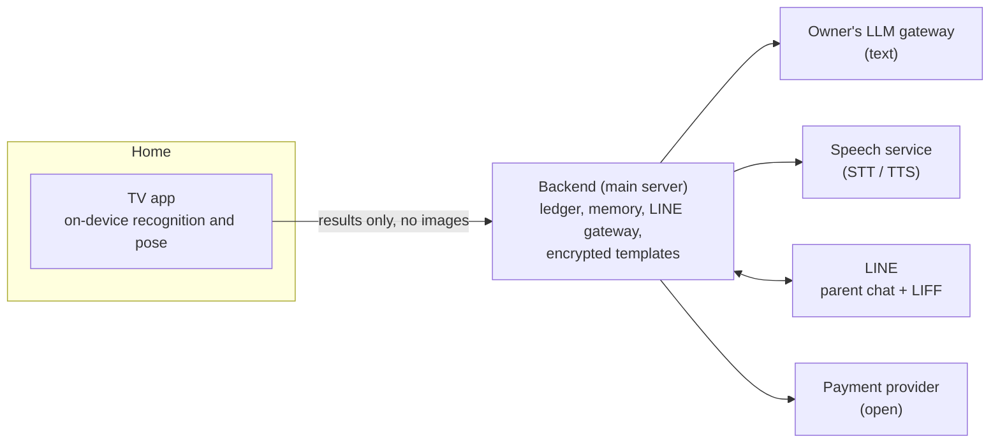

# System context

How the TV app, the backend and the outside services connect; camera images never leave the home device.

```mermaid
flowchart LR
  subgraph Home["Home"]
    TV["TV app<br/>on-device recognition and pose"]
  end
  BE["Backend (main server)<br/>ledger, memory, LINE gateway,<br/>encrypted templates"]
  LLM["Owner's LLM gateway<br/>(text)"]
  SPEECH["Speech service<br/>(STT / TTS)"]
  LINE["LINE<br/>parent chat + LIFF"]
  PAY["Payment provider<br/>(open)"]

  TV -- "results only, no images" --> BE
  BE --> LLM
  BE --> SPEECH
  BE <--> LINE
  BE --> PAY
```
