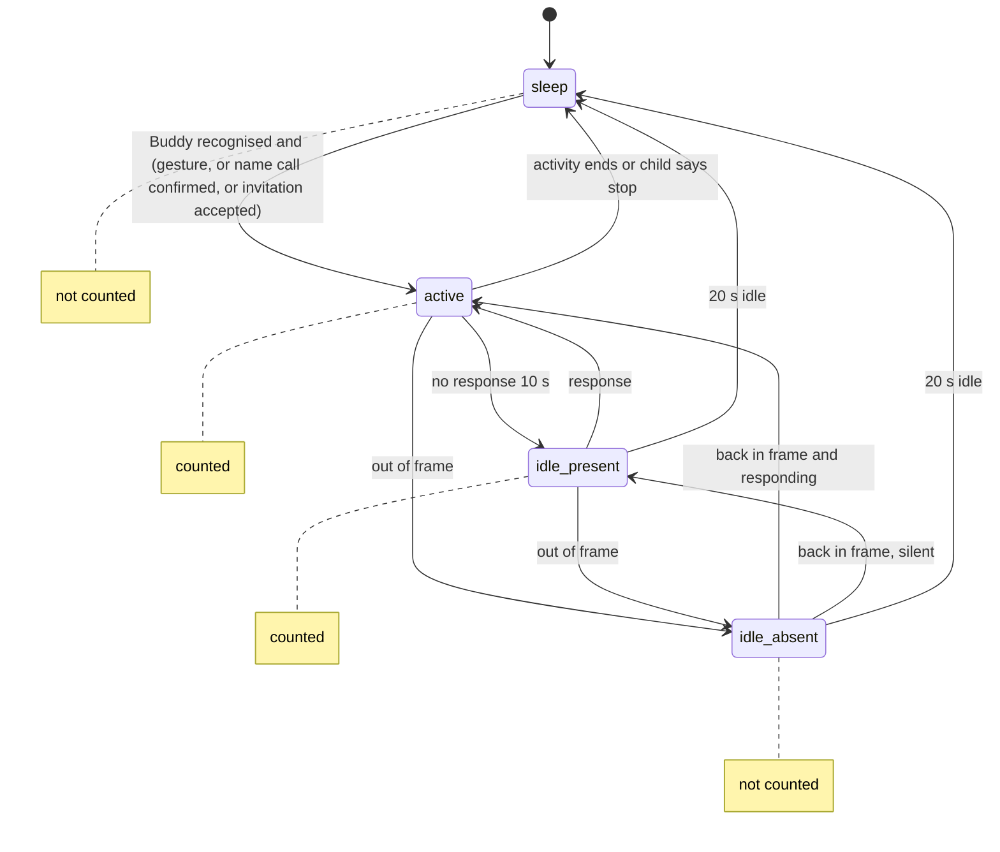

# Engagement states

The four states of an activity and the transitions between them (requirement §6); only the Buddy's time is counted.

```mermaid
stateDiagram-v2
  [*] --> sleep
  active --> idle_present: no response 10 s
  active --> idle_absent: out of frame
  idle_present --> active: response
  idle_present --> idle_absent: out of frame
  idle_absent --> active: back in frame and responding
  idle_absent --> idle_present: back in frame, silent
  idle_present --> sleep: 20 s idle
  idle_absent --> sleep: 20 s idle
  active --> sleep: activity ends or child says stop
  sleep --> active: Buddy recognised and (gesture, or name call confirmed, or invitation accepted)

  note right of active: counted
  note right of idle_present: counted
  note right of idle_absent: not counted
  note right of sleep: not counted
```
