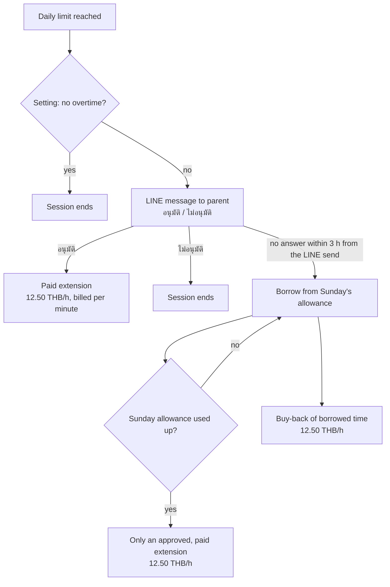

# Overtime and borrowing

What happens when the Buddy reaches the daily limit: overtime request, paid extension, borrowing from Sunday and buy-back.

```mermaid
flowchart TD
  A["Daily limit reached"] --> B{"Setting: no overtime?"}
  B -- yes --> END1["Session ends"]
  B -- no --> C["LINE message to parent<br/>อนุมัติ / ไม่อนุมัติ"]
  C -- "อนุมัติ" --> D["Paid extension<br/>12.50 THB/h, billed per minute"]
  C -- "ไม่อนุมัติ" --> END2["Session ends"]
  C -- "no answer within 3 h from the LINE send" --> E["Borrow from Sunday's allowance"]
  E --> F{"Sunday allowance used up?"}
  F -- no --> E
  F -- yes --> G["Only an approved, paid extension<br/>12.50 THB/h"]
  E --> H["Buy-back of borrowed time<br/>12.50 THB/h"]
```
