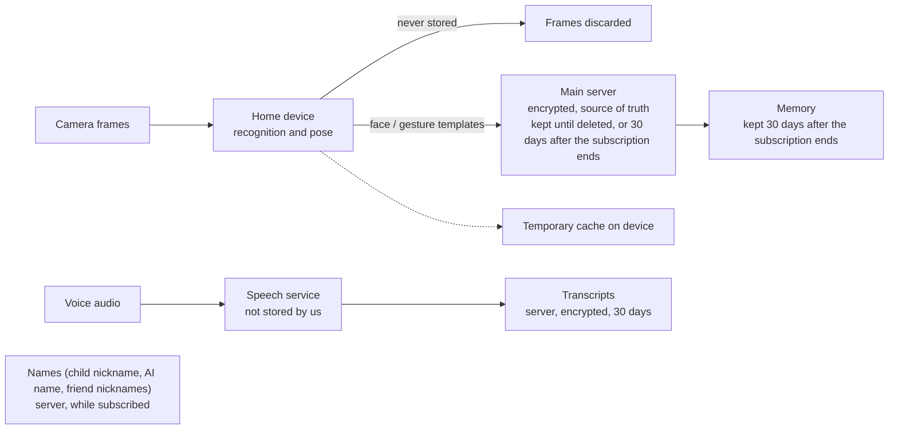

# Children's data

Where each kind of child data is processed and stored (requirement §10); camera frames never leave the home device.

```mermaid
flowchart LR
  CAM["Camera frames"] --> DEV["Home device<br/>recognition and pose"]
  DEV -- "never stored" --> NONE["Frames discarded"]
  DEV -- "face / gesture templates" --> SRV["Main server<br/>encrypted, source of truth<br/>kept until deleted, or 30 days after the subscription ends"]
  DEV -.-> CACHE["Temporary cache on device"]
  MIC["Voice audio"] --> STT["Speech service<br/>not stored by us"]
  STT --> TR["Transcripts<br/>server, encrypted, 30 days"]
  SRV --> MEM["Memory<br/>kept 30 days after the subscription ends"]
  NAMES["Names (child nickname, AI name, friend nicknames)<br/>server, while subscribed"]
```
